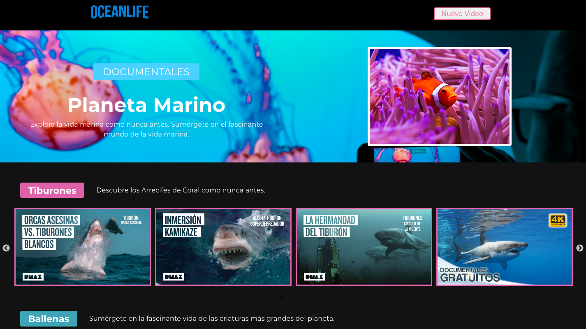
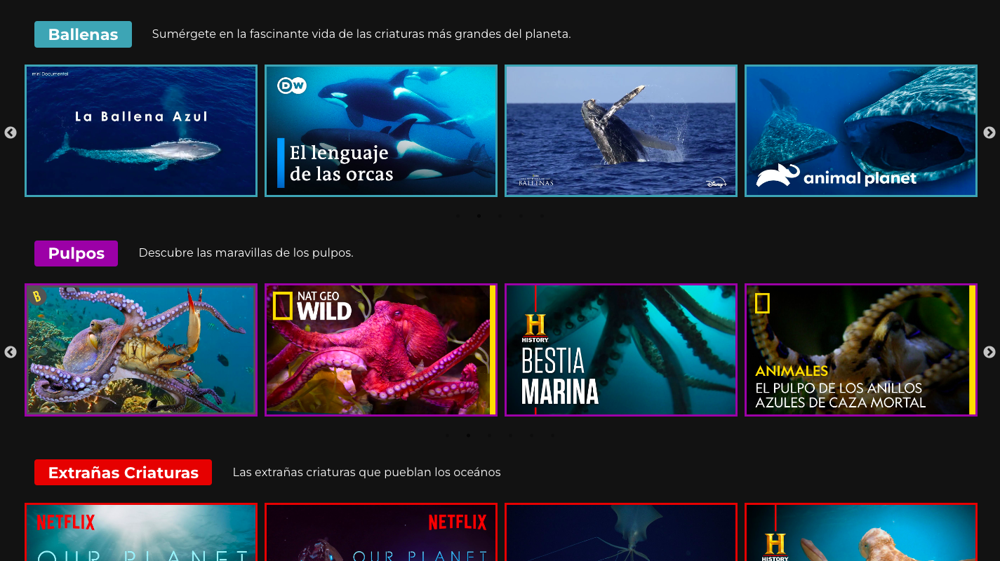

<h1>Ocean Life</h1>

Una aplicación que consiste en mostrar los últimos videos agregados desde un formulario.
<h2>General Información</h2>

<ul>
<li>Una aplicación que muestra en modo carrusel los videos agregados.</li>
</ul><ul>
<li>EL propósito es facilitar al usario la búsqueda de los videos documentales desplazandose por las categorías.</li>
</ul>

Para el administrador le permite agregar nuevos videos. Agregar, actualizar o borrar categorías desde un  formulario.
<h2>Tecnologías usadas</h2>

<ul>
<li>HTML</li>
</ul><ul>
<li>CSS</li>
</ul><ul>
<li>JavaScript</li>
</ul><ul>
<li>React</li>
</ul>
<h2>Capturas de pantalla</h2>

